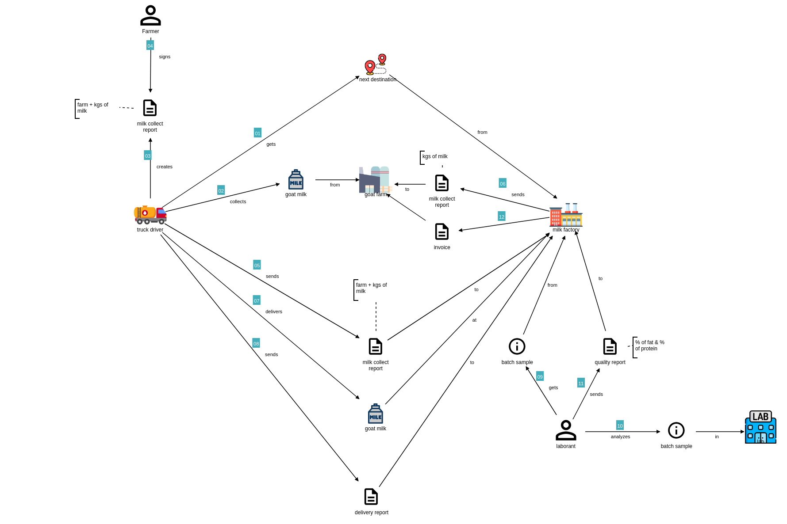

# Goatify

A repository for a workshop 'Specification by Example'. The Goatify application manages the process of collecting milk from farms, analyzing its quality, creating invoices and many more features.

## Goatify, the story



[The domain storytelling file](./assets/Collecting%20Goat%20Milk_2023-07-05.dst)

## MVP 1
The driver gets a destination, goes to the destined farm, collects kgs of milk, creates a collection report, delivers milk at the factory and creates a delivery report.

### User stories

```text
As a truck driver
I want to get the address of a destination farm
So I know where I can collect a new batch of goat milk
```

```text
As a farmer
I want sign the collect report, created by the driver
So I know the correct information is sent to the factory
```

```text
As an account manager
I want the driver to create a delivery report
So I know when and how many kilograms of milk a farm has delivered
```

## MVP 2
A worker at the lab collects a milk sample from a delivered batch, analyzes it and reports the percentage of fat and the percentage of proteins, together with a quality. Based on the quality will be decided if the milk is accepted and in which quality category.

## MVP 3
A farmer gets insight in collect-, delivery and lab reports, can see invoices for all deliveries.