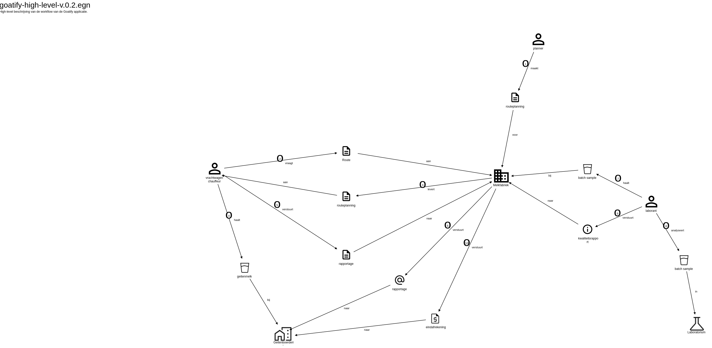

# Goatify

A repository for a workshop 'Specification by Example'. The Goatify application manages the process of collecting milk from farms, analyzing its quality, creating invoices and many more features.

## Goatify, the story

[The domain storytelling file](./assets/goatify-high-level-v.0.3.egn)
